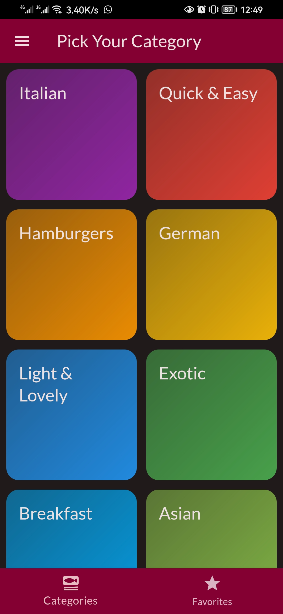
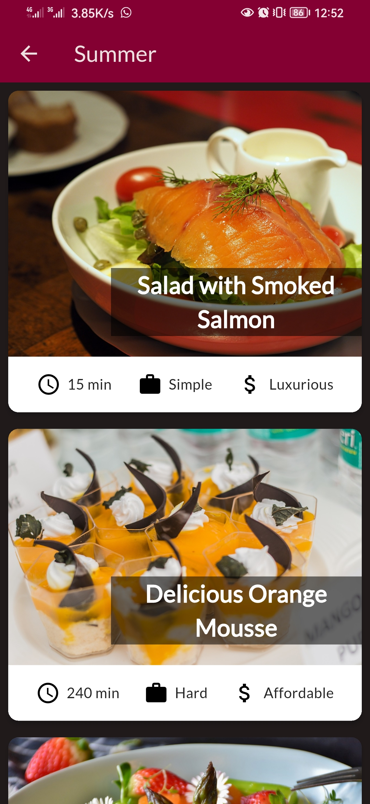
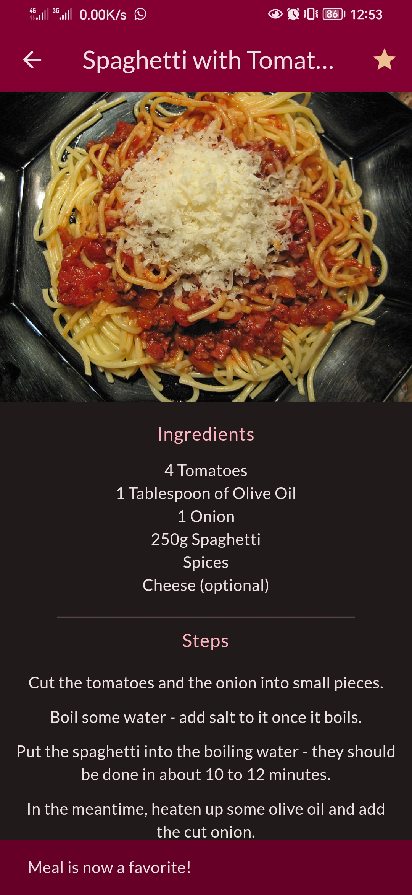
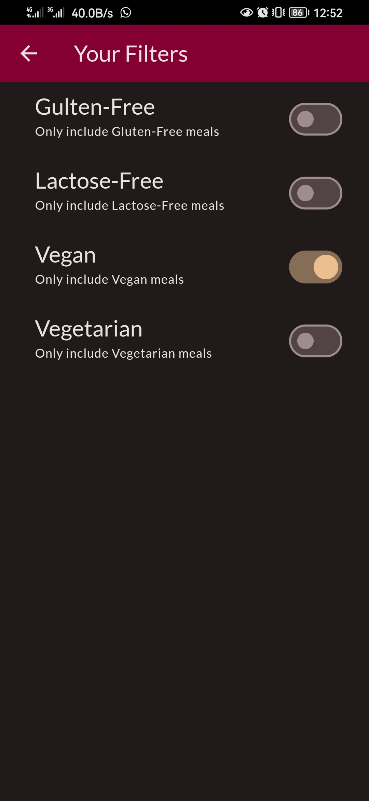
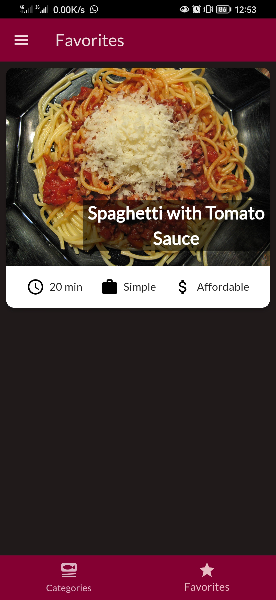
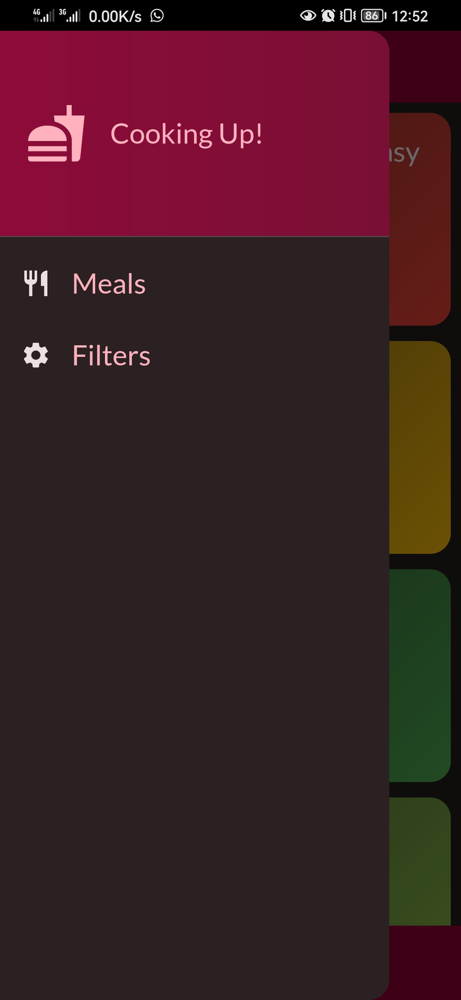

# 🍳 Cooking Up - Recipes App

A beautifully designed Flutter application that allows users to browse meals, filter recipes by dietary preferences, and mark favorites. Built with clean architecture, smooth UI animations, and effective state management using Provider.


---

## 📱 Overview

**Cooking Up** is a cross-platform mobile app developed with **Flutter** and **Provider**, designed for users to explore recipes based on dietary needs like **gluten-free**, **vegan**, **vegetarian**, and **lactose-free**.

This app focuses on **performance**, **accessibility**, and a delightful **user experience** with:

- Clean code structure
- Dynamic UI updates
- Smooth transitions and animations

---

## 🛠️ Tech Stack & Tools


---

## 🎯 Features

- ✅ Browse meals by category (e.g., Italian, Quick & Easy)
- ❤️ Mark and manage favorite meals
- 🔍 Filter meals by dietary preferences:
  - Gluten-Free
  - Lactose-Free
  - Vegan
  - Vegetarian
- 🧭 Intuitive navigation with custom transitions
- 🌗 Dark mode-friendly UI
- 🖼️ Custom illustrations and animations
- 💡 State management with **Provider**

---

## 📁 Folder Structure (Simplified)

```plaintext
lib/
├── main.dart
├── models/            # Data models
├── screens/           # UI screens
├── widgets/           # Reusable UI components
├── providers/         # State management logic
```

---

## 📸 Screenshots

| Categories Screen                         | Category Items                                    | Recipe Details                                    |
| ----------------------------------------- | ------------------------------------------------- | ------------------------------------------------- |
|  |  |  |

| Filters Screen                      | Favorites Screen                        | Drawer                            |
| ----------------------------------- | --------------------------------------- | --------------------------------- |
|  |  |  |

---

## 📦 Packages Used

- [`provider`](https://pub.dev/packages/provider) — state management
- [`flutter_svg`](https://pub.dev/packages/flutter_svg) — SVG rendering
- [`google_fonts`](https://pub.dev/packages/google_fonts) — custom fonts
- [`shared_preferences`](https://pub.dev/packages/shared_preferences) — save favorite meals locally

---

## 💡 What I Learned

- Creating flexible filtering systems with clean logic
- Managing app-wide state efficiently using **Provider**
- Designing smooth Flutter UIs with reusable components
- Building intuitive multi-screen navigation with custom transitions
- Applying clean architecture principles for scalability and maintainability

---

## 🙌 Credits

Design inspired by [The Complete Flutter Development Guide (Udemy)](https://www.udemy.com/course/fluttercourse/), customized and extended with personal improvements.

---

## 🚫 Disclaimer

This repository does not contain source code or build files (APK/IPA).  
It serves as a visual and structural showcase for portfolio and review purposes.

---

## 🔗 Connect with Me

[](https://www.linkedin.com/in/mahmoudhassan0)  
[](https://github.com/MahmoudHassan12)
